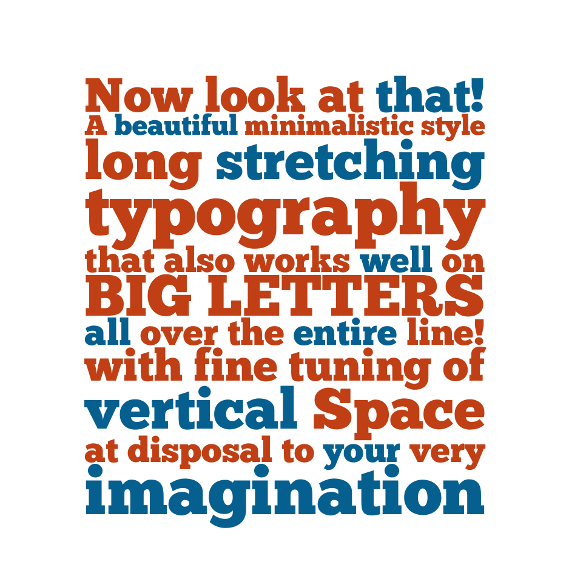

# Wunderkarte

A beautiful vintage LaTeX template.

## What?



This is great for posters, invitations or even business cards.

## Usage

To stretch text to full-width of the page, use the shortcut

``` latex
\wunder{Here comes the text}
```

In order to reduce the vertical space _after_ a line, use the shortcut

``` latex
\vsp{-.2}
```

Place it _before_ the line that you want it to have reduced vertical space!

Thanks to <a href="http://www.theleagueofmoveabletype.com/">The League of Movable Type</a> for their open source font
<a href="http://www.theleagueofmoveabletype.com/chunk">Chunk</a> that's being used in this example.
